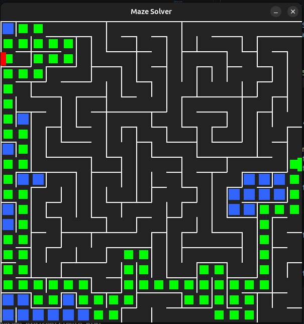
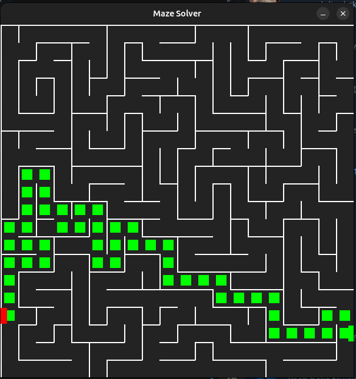
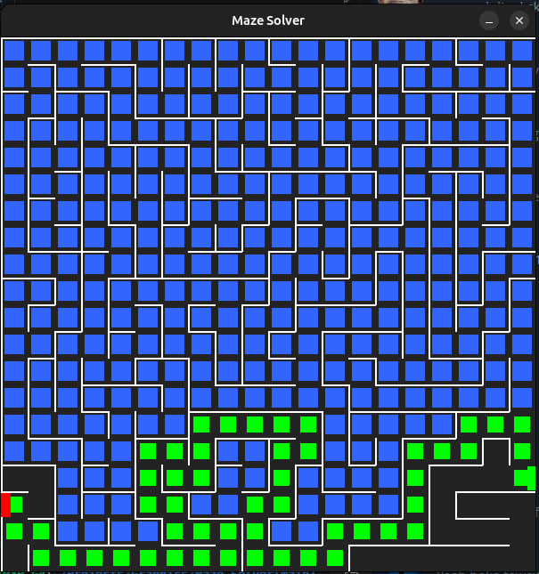

# Maze Generator and Solver

A graphical maze generator and solver implemented in Python using `pygame`.

This project demonstrates:
- Random maze generation using a stack-based Depth First Search (DFS)
- Maze solving using backtracking DFS
- Dynamic visualization of the maze creation and solving processes including dead ends and final path

---

# Features and Algorithms Used

## 1. Maze Generation
The maze generation uses:

- Randomized Depth First Search (DFS)
- Explicit stack-based backtracking

### Steps
1. Start with all walls intact
2. Choose a random starting cell
3. Mark it visited
4. Repeatedly:
   - Choose a random unvisited neighbor
   - Remove the connecting wall
   - Move to that cell
5. If trapped:
   - Backtrack using the stack
6. Continue until all cells are visited

This produces a spanning tree of the maze graph.

---

## 2. Maze Solving
The solver also uses DFS with backtracking.

### Steps
1. Start from the entrance
2. Move randomly through valid openings
3. Store the path on a stack
4. If trapped:
   - Mark the cell as a dead end
   - Backtrack
5. Continue until the exit is found

## 3. Display

Colors used:
- current position     -> RED
- dead ends            -> BLUE
- current/final path   -> GREEN
- starting position    -> RED
- ending position      -> GREEN

---

# Data Structures

The maze follows the assignment specification using:

```python
north_wall[row][col]
east_wall[row][col]
```

Each cell stores:
- Whether its north wall exists
- Whether its east wall exists

Additional structures:
- `visited[][]`
- `solution_visited[][]`
- Stack for DFS generation
- Stack for DFS solving

---

# Project Structure

```text
Maze-Solver/
│
├── main.py      # entry point 
├── maze.py      # main class
├── constants.py # defined constants
├── README.md
├── .gitignore
```

---

# Installation

## Requirements

- Python 3.x
- pygame

Install pygame:

```bash
# set up virtual environment (if neccessary)
python3 -m venv venv
source venv/bin/activate

pip install pygame
```

---

# Running the Program

Run:

```bash
python3 main.py
```

---

# Controls

* Close Window to Exit program

---

# Why Stack Was Chosen Instead of Queue for storing candidates

DFS with a stack creates:
- Long corridors
- More natural-looking mazes
- Deep winding paths

Using a queue (BFS) would generate:
- Shorter corridors
- More uniform expansion
- Less interesting maze structures

DFS produces more visually appealing mazes.

---

# Loom video

[Loom video](./assets/Screencast%20from%202026-05-08%2004-30-59.webm)

---

# Screenshots





---

# Author

```
Name: Zeamanuel Mebit    
ID: UGR/9677/16   
Sec: 2
```